# Prism - 계약서 분석 및 관리 서비스

## 0. 팀원

| **이름** | **역할** | **기술 스택** |
| --- | --- | --- |
| 허경환(팀장) | AI, Infra | `FastAPI` `Docker` `Jenkins` `MariaDB` `Milvus` |
| 김상훈 | BE | `Spring` `JPA` `QueryDSL` `Redis` `MariaDB` |
| 김영표 | FE, BE, Infra | `FastAPI` `Spring`  `React` `Docker` `MongoDB` |
| 박찬규 | BE, Infra | `Spring` `JPA` `Jenkins` `Docker` `MongoDB` `MariaDB` |
| 권대형 | FE | `React` `Typescript` `styled-components`  |
| 최우진 | FE | `React` `Typescript` `Redux` `styled-components`  |

## 1. 프로젝트 개요

계약서는 일상 생활에서 필수적인 요소지만, 많은 사람들이 계약서를 제대로 읽지 않거나 이해하지 않고 서명하는 경우가 많습니다. 영국의 University of Law에 따르면, 68%의 사람들이 계약서를 읽지 않거나 이해하지 못한다고 합니다. 계약서는 종종 악의적인 조항을 포함하고 있어, 계약 당사자에게 막대한 피해를 줄 수 있는 잠재적인 위험을 내포하고 있습니다.

이에 저희는 계약 조항의 위험도를 사전에 파악하여 피해를 줄일 수 있는 플랫폼을 만들게 되었습니다. **Prism**은 계약서 분석과 관리를 위한 전용 플랫폼으로, 사용자가 계약서의 위험 요소를 쉽게 이해하고 관리할 수 있도록 돕습니다.

## 2. 서비스 개요

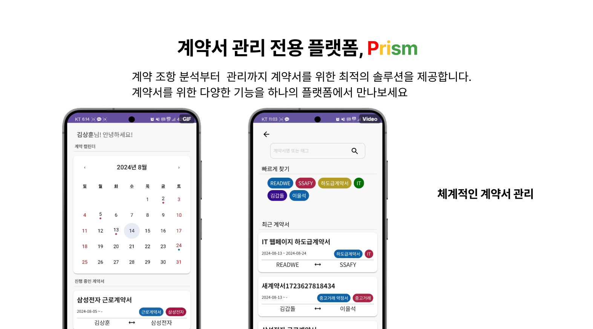

**Prism**은 계약서 관리와 분석을 위한 종합 플랫폼입니다. 사용자는 계약서를 업로드하고, 위험, 주의, 안전 조항에 대한 분석 결과를 시각적으로 확인할 수 있습니다. 이 플랫폼은 사용자의 계약서를 체계적으로 관리하고, 중요한 일정을 놓치지 않도록 도와줍니다.

### 계약서 관리 기능

- **캘린더 기능**: 계약서의 발효 및 만료 날짜를 캘린더에 표시하여, 현재 어떤 계약서가 유효한지 쉽게 확인할 수 있습니다.
- **파일 디렉토리 관리**: 파일 디렉토리 구조를 통해 계약서를 손쉽게 관리하고 이동할 수 있으며, 계약서 정보를 직접 수정할 수 있습니다.
- **검색 기능:** 추천 태그들을 이용할 수 있는 빠르게 찾기나 계약서명 및 태그 검색 기능을 활용하여 다시 보고 싶은 계약서들을 간편하게 찾을 수 있습니다.

### 계약서 분석 기능

- **원문에서 보기**: 사용자가 올린 계약서 이미지와 분석 결과를 함께 확인할 수 있습니다.
    - **이미지 오버레이 및 하이라이트**: 사용자가 계약서 이미지에서 특정 부분을 선택하면, 해당 부분이 하이라이트 처리됩니다. 이 오버레이 기능을 통해 사용자는 계약서 원문과 분석된 결과를 직관적으로 비교할 수 있습니다.
    - **분석 내용 확인**: 하이라이트된 계약서 원문의 특정 부분과 대응하는 분석 내용을 함께 화면에 표시하여, 사용자가 계약서의 의미를 더욱 명확하게 이해할 수 있도록 돕습니다.
- **한눈에 보기**: 원본 이미지를 제외하고 계약서의 조항과 분석 결과를 차례대로 제공하여 사용자가 내용을 쉽게 파악할 수 있도록 시각화된 화면을 제공합니다. 또한 필터링을 통해 위험, 주의, 안전 조항들을 분류하여 볼 수 있습니다.

## 3. 주요 기술 및 아키텍처

### RAG (Retrieval-Augmented Generation) 기반의 위험 조항 응답 생성

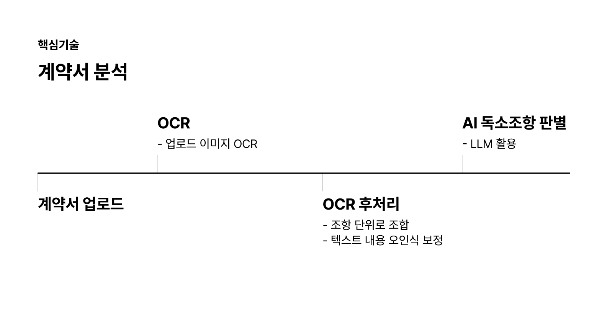

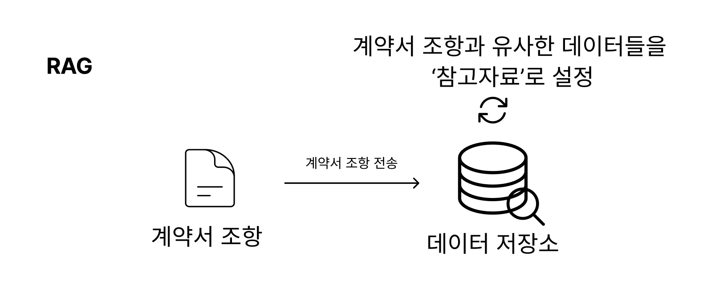

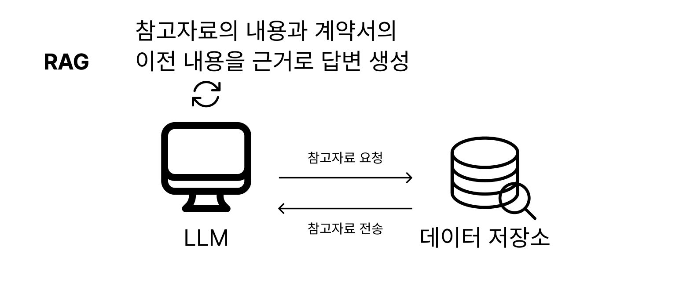

Prism은 LLM (Large Language Model)에 RAG 구조를 적용하여 계약서의 위험 조항에 대한 응답을 생성합니다. 생성형 AI를 사용하여 계약서의 조항을 판별하고, 부정확한 정보 전달 문제를 해결하기 위해 다음과 같은 과정을 거칩니다:

1. **텍스트 추출**: 업로드된 계약서 이미지로부터 텍스트를 추출합니다.
2. **후처리 작업**: 계약 조항 단위로 텍스트를 묶는 작업을 수행합니다.
3. **ETL**: 신뢰할 수 있는 법률 데이터를 벡터DB에 저장합니다.
4. **레퍼런스 설정**: 분석 요청된 계약서 조항과 유사한 상위 10개의 데이터를 레퍼런스로 설정합니다.
5. **답변 생성**: 프롬프트 엔지니어링으로 생성형 AI가 레퍼런스와 계약서 이전 내용들에만 근거하여 답변을 생성하도록 지시합니다.

이 구조를 통해 Prism은 사용자에게 정확한 판별 결과와 그에 대한 이유를 제공합니다.

### 서비스 아키텍쳐

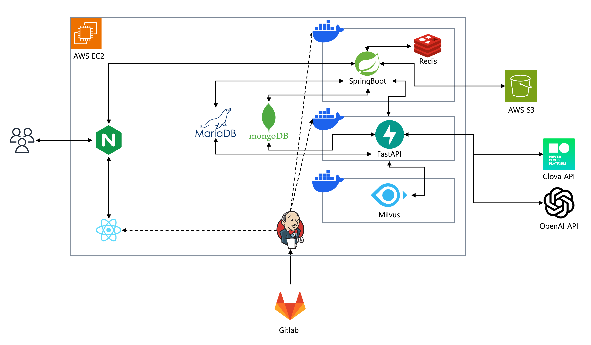

## 4. 사용 예시

Prism은 다양한 계약서 분석 시나리오에 적합하며, 아래와 같은 과정을 통해 사용될 수 있습니다:

1. **로그인**: 카카오 아이디를 이용해 로그인합니다.
    
    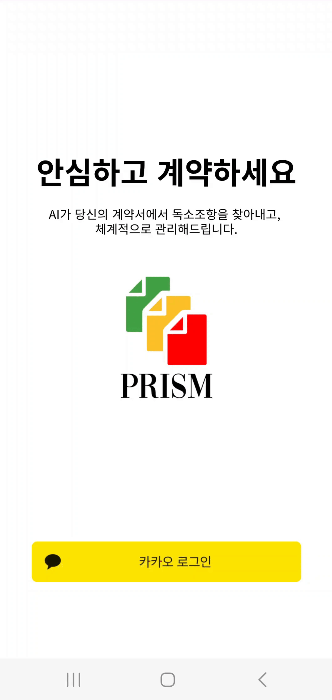
    
2. **계약서 업로드**: 사용자가 계약서 이미지를 촬영하여 업로드합니다.
    
    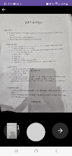
    
3. **분석 결과 확인**: 업로드된 계약서의 조항별 분석 결과를 원문에서 보기와 한눈에 보기 화면에서 확인합니다.
    
    
    
    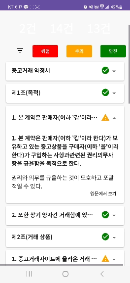
    
4. **계약서 관리**: 캘린더와 디렉토리 구조를 통해 계약서를 체계적으로 관리하고 자동으로 생성된 태그를 통해 검색할 수 있습니다.

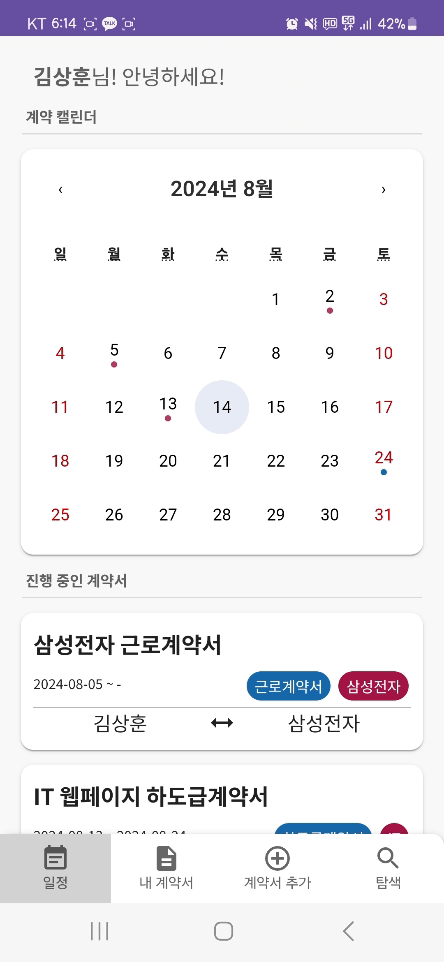

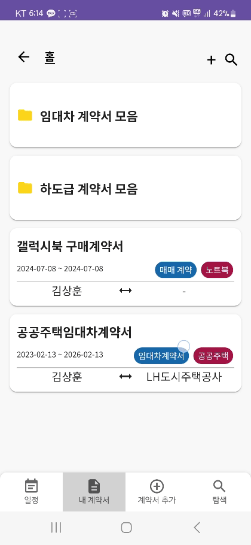

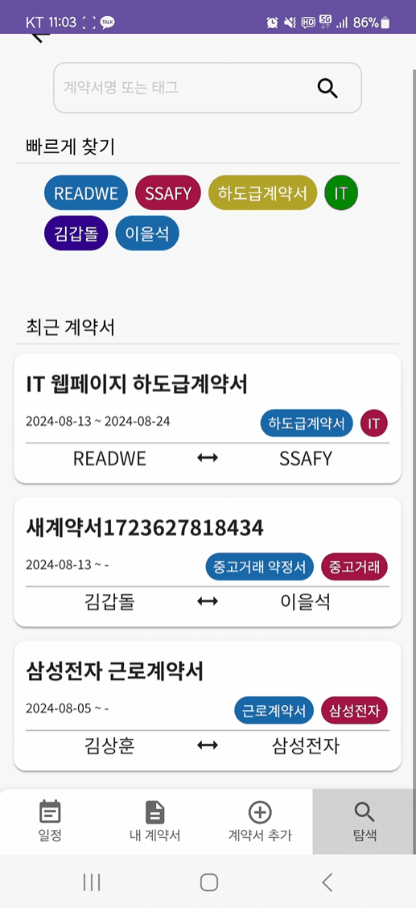

## 5. 결론

Prism은 계약서의 위험 요소를 사전에 파악하여, 사용자에게 안전한 계약 체결을 돕는 플랫폼입니다. 이를 통해 사용자들은 복잡한 계약서 조항 속에 숨겨진 위험을 쉽게 이해하고 관리할 수 있습니다.

## 6. UI/UX기획


https://www.figma.com/design/DPGjHDYwVueZcWok0jmcPh/UI?node-id=467-5908&t=2KWmSjCL6dRo1Myg-1

# DB 설계

## MariaDB ERD

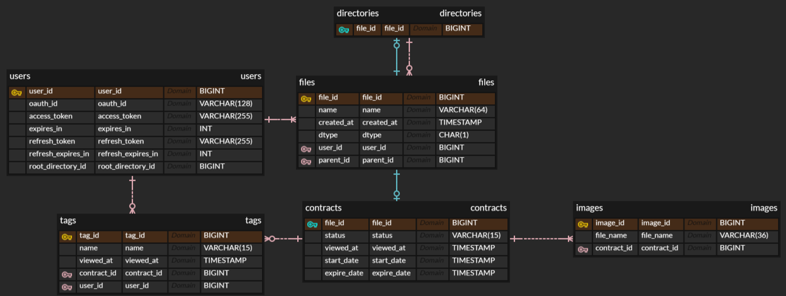

### files, contracts, directories 테이블에서 One-To-One 전략을 사용한 이유

Directory와 Contract는 클래스 설계 상 File의 서브 클래스이다. 상속 관계를 DB에서 구현하는 방법은 크게 3가지이다. 각각의 서브클래스를 모두 다른 테이블로 저장하는 RollDown전략, 모든 서브클래스를 하나의 테이블로 저장하는 RollUp전략, 슈퍼클래스와 서브클래스를 연관관계를 설정하여 Join해서 사용하는 One-To-One 전략이다.

RollDown 전략은 서브클래스에 대한 트랜잭션이 많이 발생할 경우 적합한 전략이다. RollUp 전략은 서브클래스 전체에 대한 트랜잭션이 많이 발생하는 경우 적합한 전략이다. One-To-One 전략은 슈퍼클래스와 서브클래스에 대한 트랜잭션이 모두 발생하는 경우 적합한 전략이다.

directory와 contract에 대한 서비스가 슈퍼클래스와 서브클래스에 대한 트랜잭션이 다 발생하므로, One-To-One 전략이 적합하다고 판단했다. One-To-One 전략 사용 시 Join 트랜잭션이 자주 발생하지만 그로 인한 Cost가 발생하더라도 성능적 요구사항을 충분히 만족한다고 판단하여 One-To-One 전략을 최종적으로 선택하였다.

## MongoDB Collection

```json
{
    "_id": Integer, // 계약서 고유 ID (유니크 식별자)
    "clauses": [  // 계약서 내 조항들의 리스트
        {
            "type": String, // 조항의 유형 (예: "safe", "caution", "danger")
            "content": String, // 조항의 내용 (계약서에 실제로 명시된 텍스트)
            "result": String,  // 조항에 대한 분석 결과 (해당 조항이 독소 조항인지, 문제 없는 조항인지 등에 대한 설명)
            "boxes": [  // 조항이 계약서 내 위치하는 영역(좌표와 페이지 정보)
                {
                    "ltx": Float, // 좌측 상단 x좌표
                    "lty": Float, // 좌측 상단 y좌표
                    "rbx": Float, // 우측 하단 x좌표
                    "rby": Float, // 우측 하단 y좌표
                    "page": Integer   // 페이지 번호 (조항이 위치한 페이지)
                }
            ]
        },
    ]
}
```

### MongoDB를 사용한 이유

계약서의 분석 결과를 RDBMS로 관리한다면 분석 결과 테이블, 계약서 조항 테이블, 계약서 조항들의 영역 테이블이 모두 따로 정의하여 관리해야 한다. 요구사항에 따라 분석 결과를 불러올 때 세 테이블의 데이터를 모두 한 번에 불러와야 한다. 각 테이블에 따로 접근하는 트랜잭션은 존재하지 않았다. 한 번에 불러올 때 3개의 테이블을 2중 Join연산으로 가져와야 한다. 읽기 트랜잭션에 대한 Cost는 증가하지만 이로 인한 이득은 없다. 따라서 현재 프로젝트에서는 비효율적이라 판단했다.

분석 결과를 하나로 저장하기 위해 문서형태로 저장하는 MongoDB를 사용했다. MongoDB의 문서로 저장하여 불필요한 Join연산을 줄일 수 있었다. MongoDB를 사용할 때 데이터 일관성 문제가 발생할 수 있게 된다. 하지만 분석 결과 데이터는 수정되는 일이 없으므로 일관성 문제가 발생하지 않는다. 따라서 MongoDB에 데이터를 저장하는 것이 적합하다고 판단했다.

### Redis

- **멱등성 보장**: 동일한 생성 요청이 10초 내로 중복 발생할 경우 이를 차단하여 멱등성을 보장하기 위해 사용했습니다.
- **빠른 검색**: 자주 변하지 않는 데이터(계약서 상세 정보 - 계약서 사진과 계약서 분석 내용으로 구성됨)를 캐싱하여, 빠른 검색 성능을 제공합니다. 캐싱을 통해 몽고DB, S3, MariaDB에 접근해야 하는cost를 효과적으로 줄일 수 있습니다.

## API 명세서

| **설명** | **Method** | **URI** | **query** | **body** | **response** | **error** |
| --- | --- | --- | --- | --- | --- | --- |
| **계약서 상세 조회** | `GET` | [/api/v1/contracts/:id](/api/v1/contracts/:id) |  |  | 200 | 401, 403, 404 |
| **계약서 검색** | `GET` | [/api/v1/contracts](/api/v1/contracts) | keyword, startDate, endDate |  | 200 | 401, 403 |
| **계약서 생성**   | `POST` | [/api/v1/contracts](/api/v1/contracts) |  | name, tags[], parentId, images[] | 201 | 403, 409 |
| **계약서 수정** | `PUT` | [/api/v1/contracts/:id](/api/v1/contracts/:id) |  | name, tags[], parentId, startDate, expireDate | 200 | 403, 409 |
| **계약서 삭제** | `DELETE` | [/api/v1/contracts/:id](/api/v1/contracts/:id) |  |  | 200 | 401, 403, 404 |
| **회원정보 수정** | `PUT` | [/api/v1/users/:id](/api/v1/users/:id) |  | username, password | 200 | 403 |
| **회원가입** | `POST` | [/api/v1/users](/api/v1/users) |  | username, email, password | 201 | 400 |
| **로그아웃** | `POST` | [/api/v1/users/logout](/api/v1/users/logout) |  | id | 200 | 400 |
| **로그인** | `POST` | [/api/v1/users/login](/api/v1/users/login) |  | email, password | 200 | 400 |
| **회원탈퇴** | `DELETE` | [/api/v1/users/:id](/api/v1/users/:id) |  |  | 200 | 401, 403, 404 |
| **회원정보조회** | `GET` | [/api/v1/users](/api/v1/users) |  |  | 200 | 401, 403, 404 |
| **디렉토리 생성** | `POST` | [/api/v1/directories](/api/v1/directories) |  | name, parentId | 201 | 400, 401, 403, 409 |
| **디렉토리 내용 조회** | `GET` | [/api/v1/directories/:id/files](/api/v1/directories/:id/files) |  |  | 200 | 401, 403, 404 |
| **디렉토리 수정** | `PUT` | [/api/v1/directories/:id](/api/v1/directories/:id) |  | name, parentId | 200 | 400, 401, 403, 404, 409 |
| **디렉토리 삭제** | `DELETE` | [/api/v1/directories/:id](/api/v1/directories/:id) |  |  | 200 | 401, 403, 404 |
| **계약서 분석(내부 서버)** | `POST` | [:3000/contract/{contract_id}](:3000/contract/{contract_id}) |  |  |  |  |
| **디렉토리 조회** | `GET` | [/api/v1/directories/:id](/api/v1/directories/:id) |  |  | 200 | 401, 403, 404 |
| **카카오 OAuth 로그인** | `POST` | [/api/v1/oauth/login](/api/v1/oauth/login) |  | code | 200 |  |
| **전체 태그 조회** | `GET` | [/api/v1/tags](/api/v1/tags) |  |  |  |  |

# UCC

[](https://youtu.be/Z37LxsptQvA)

https://youtu.be/Z37LxsptQvA

## Notion

[Prism - 계약서 분석 및 관리 서비스](https://www.notion.so/Prism-9397eea709cb430eb33726cb93db0013?pvs=21)